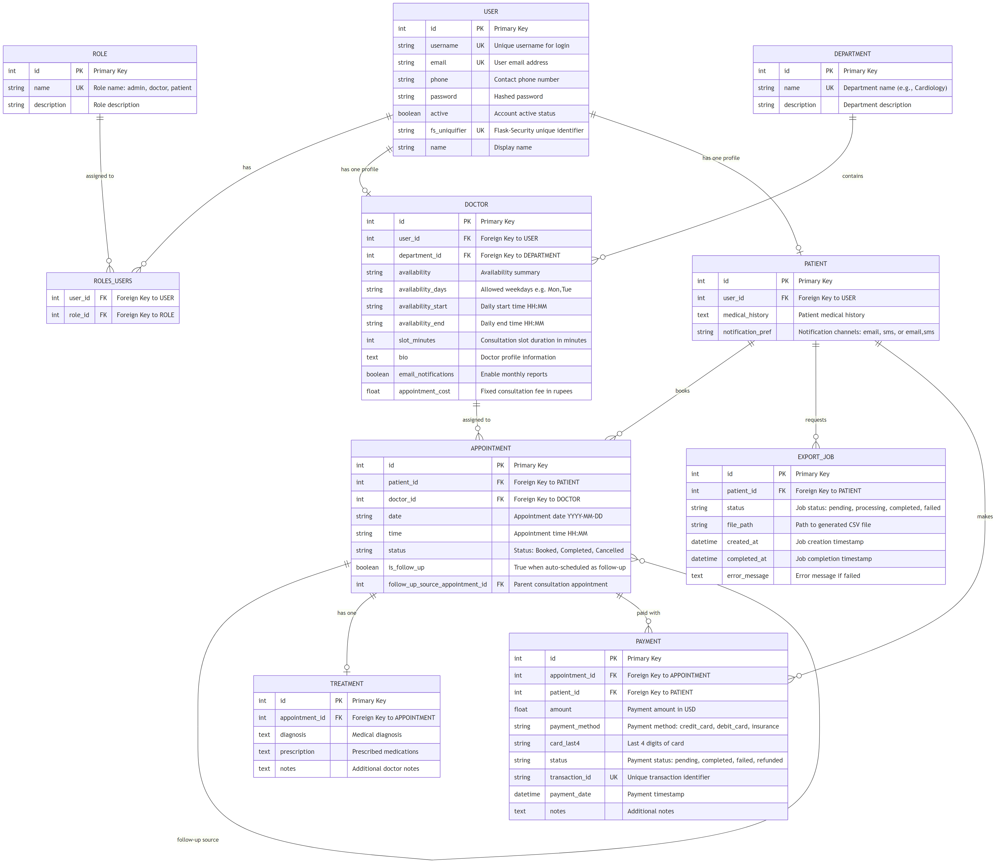

# Hospital Management System

**Student Name:** Abdul Ahad  
**Student ID:** 24f2002963  
**Email:** 24f2002963@ds.study.iitm.ac.in

**Course:** Modern Application Development 2 Project  

---

## 1. Abstract

This report describes the design and implementation of a Hospital Management System, a full-stack web application that digitalises and streamlines core hospital operations. The system manages patients, doctors, appointments, treatments, and payments through a unified platform that enforces role-based access control. Three distinct user roles are provided: admins who configure and oversee the entire system, doctors who manage their schedules and patient treatment records, and patients who self-register, book appointments, and view their medical history. The backend is implemented in Python using the Flask with an SQLite relational database, Redis for caching, and Celery for asynchronous background job execution. The frontend is built with Vue.js 3. The system includes scheduled jobs for daily patient appointment reminders and monthly doctor activity reports delivered via email, as well as a user-triggered CSV export of treatment history. The resulting application is modular, maintainable, and demonstrates practical application of core software engineering principles including RESTful API design, role-based access control, event-driven background processing, and optimistic concurrency control.

---

## 2. Problem Statement

Hospitals require coordinated management of multiple entities — staff, patients, appointments, and records — often with competing demands. The specific problems this system addresses are:

**Scheduling Conflicts:** Without centralised scheduling, double-booking of doctor time slots is a common occurrence. Patients and staff lack visibility into a doctor's real-time availability.

**Disconnected Records:** Patient medical histories, diagnoses, and prescriptions are often siloed per appointment. This prevents doctors from building a view of a patient's health over time.

**Manual Communication:** Reminding patients of upcoming appointments, notifying doctors of their monthly performance, and alerting patients when their data export is complete are operations typically handled manually or not at all.

**Payment Tracking:** The financial exchange for consultations requires a clear record linking patients, doctors, appointments, and amounts, with support for refunds when appointments are cancelled.

**Access Control:** Different stakeholders have different informational needs and permissions. Patients must not see other patients' records. Doctors must not modify system-wide configurations. Admins must be able to oversee all entities.

---

## 3. Technology Stack

| Component | Technology | Rationale |
|---|---|---|
| Backend framework | Flask (Python) | Lightweight, extensible, large ecosystem |
| Authentication | Flask-Security | RBAC, password hashing, session management |
| ORM | SQLAlchemy (Flask-SQLAlchemy) | Abstraction over SQL, additive migration support |
| Database | SQLite | Zero-configuration, sufficient for project scale |
| Cache and Broker | Redis | In-memory speed, supports pub-sub and task queuing |
| Background jobs | Celery | Production-grade distributed task queue |
| Email delivery | Flask-Mail | Standard email delivery through SMTP providers |
| PDF generation | ReportLab | Python-native PDF creation for monthly reports |
| Frontend | Vue.js 3 (CDN) | Reactive components, minimal build tooling |
| CSS | Bootstrap 5 | Responsive grid, accessible components |
| Charts | Plotly.js | Interactive dashboard visualisations |

---

## 4. Database Design

### 4.1 Entity Overview

The database comprises eight core entities:

- **User** — Shared authentication record for all user types.
- **Role** and **roles_users** — Flask-Security RBAC relationship table.
- **Department** — Medical specialisation (e.g., Cardiology, Neurology).
- **Doctor** — Doctor-specific profile extending User, linked to a Department.
- **Patient** — Patient-specific profile extending User.
- **Appointment** — Booking linking Patient and Doctor for a specific date and time slot.
- **Treatment** — Consultation outcome (diagnosis, prescription, notes) linked to a completed Appointment.
- **Payment** — Financial transaction record linked to an Appointment and Patient.
- **ExportJob** — Tracks asynchronous CSV export requests initiated by patients.

### 4.2 Key Design Decisions

**User-Profile Separation:** All users share a single `User` table for authentication credentials. Type-specific data is stored in linked `Doctor` and `Patient` profile records. This simplifies credential management and allows Flask-Security to operate on a single unified model.

**Structured Availability Storage:** Doctor availability is stored as three structured columns — `availability_days` (comma-separated weekday abbreviations), `availability_start` and `availability_end` (HH:MM strings), and `slot_minutes` (integer duration). This enables the backend to programmatically generate all valid time slots and compare them against existing bookings without complex date arithmetic.

**Fixed Consultation Fee per Doctor:** The `Doctor` model includes an `appointment_cost` column set by the admin. This value is the single source of truth for each appointment's payment amount; the patient cannot override it during the payment step, ensuring billing consistency.

**Appointment Uniqueness Constraint:** A database-level unique index on `(doctor_id, date, time)` prevents race conditions when multiple patients attempt to book the same slot simultaneously, providing a final guarantee beyond the application-level retry logic.

**Follow-up Appointment Traceability:** An `is_follow_up` boolean and `follow_up_source_appointment_id` self-referencing foreign key on the Appointment table allow doctors to schedule follow-up consultations from within the completion workflow while maintaining a clear parent-child relationship.

**Payment as Audit Ledger:** Payment records use positive amounts for completed transactions and negative amounts for refunds. This ledger-style approach allows net figures to be computed with simple arithmetic and maintains a full immutable audit trail.

**Notification Preference as Comma-Separated Channels:** The `Patient` model's `notification_pref` column stores a comma-separated list of opted-in channels (`email`, `sms`, or `email,sms`). This replaces the single-value enum from earlier versions, allowing patients to opt into multiple channels simultaneously.

### 4.3 Entity Relationships

Key relationships include:

- `USER` one-to-one with `DOCTOR` (profile extension via `user_id` FK)
- `USER` one-to-one with `PATIENT` (profile extension via `user_id` FK)
- `DEPARTMENT` one-to-many with `DOCTOR`
- `PATIENT` one-to-many with `APPOINTMENT`
- `DOCTOR` one-to-many with `APPOINTMENT`
- `APPOINTMENT` one-to-one with `TREATMENT`
- `APPOINTMENT` one-to-many with `PAYMENT` (one per transaction, including refunds)
- `PATIENT` one-to-many with `EXPORT_JOB`
- `APPOINTMENT` self-referencing for follow-up linkage

---

## 5. Implementation

### 5.1 Authentication and Authorisation

Flask-Security manages user sessions using cookie-based tokens. The `roles_required` decorator gates each route to the appropriate user type. The patient self-registration endpoint creates only `patient`-role users; doctor creation is exclusively an admin operation.

### 5.2 Appointment Booking and Serial Slot Assignment

The booking system uses a serial slot-assignment algorithm to ensure fairness and prevent conflicts:

1. The patient selects a doctor and a date from the doctor's 7-day availability window.
2. The backend generates all possible time slots between the doctor's start and end time at the configured slot granularity.
3. Already-booked slots for that doctor and date are excluded from the candidate list.
4. The first remaining slot is assigned to the new appointment.
5. A retry loop of three attempts handles the race condition where a concurrent booking takes the assigned slot between generation and the database commit.

### 5.3 Treatment and Patient History

When a doctor marks an appointment as completed, they record a diagnosis, prescription, and optional notes. This creates a `Treatment` record. Simultaneously, a short summary is appended to the patient's cumulative `medical_history` text field for a quick plain-text log. Doctors can subsequently edit any treatment record they originally created.

### 5.4 Payment Portal

The payment portal simulates an actual payment gateway to demonstrate the integration architecture without connecting to a live payment provider. The consultation fee for each appointment is fixed by the administator at the doctor level. When a patient initiates payment, the amount is read from the doctor's `appointment_cost` and displayed. When a patient cancels a paid appointment, the system automatically creates a corresponding refund `Payment` record with a negative amount.

### 5.5 Doctor Availability Management

Doctors configure their availability through the Availability tab: they select which days of the week they are available, their working hours, and the consultation slot duration. When a doctor saves their availability, the cache for the public doctor listing is invalidated so patients immediately see the updated schedule. Admin users can also configure doctor availability when creating or editing a doctor profile.

### 5.6 Admin Capabilities

The admin has system oversight including creating, editing, and deleting doctors and patients; managing departments; viewing all appointments with multi-dimensional filters; auditing all payment transactions; and accessing aggregate statistics. When creating or editing a doctor, the admin sets the fixed cost patients will be charged for appointments with that doctor. A dedicated Doctor's Patients panel allows the admin to inspect all patients linked to any specific doctor and edit them directly.

### 5.7 Patient Capabilities

Registered patients can browse doctors as interactive profile cards, each showing the doctor's name, department, availability, slot duration, consultation fee, and bio. Cards can be filtered by department selection or searched by name, allowing patients to quickly find the appropriate specialist. After consultation, they can view their full treatment history including diagnosis, prescription, and doctor's notes in a read-only format; history is updated automatically by the system. Patients can also export their complete treatment record as a CSV file. Notification preferences are configured via Email and SMS checkboxes in the profile settings.

---

## 6. Background Jobs and Asynchronous Processing

### 6.1 Architecture

Celery manages all background task execution. Redis serves as both the message broker (task queue) and result backend. A `ContextTask` base class injects the Flask application context into every task execution, making database sessions, configuration, and extensions available within background code.

### 6.2 Daily Appointment Reminders

A Celery Beat periodic task runs every morning at 8:00 AM. It queries all appointments scheduled for the current day with status "Booked" and a corresponding completed payment. For each qualifying appointment, a reminder is sent to the patient detailing the appointment time and doctor. The notification respects each patient's `notification_pref` setting, which stores a comma-separated list of opted-in channels. If both `email` and `sms` are listed, the patient receives reminders through both channels simultaneously.

### 6.3 Monthly Doctor Activity Report

On the first calendar day of each month, Celery Beat dispatches a task that iterates over all doctors with email notifications enabled. For each doctor, it queries all appointments in the preceding month, computes statistics (total appointments, completed, cancelled, unique patients treated), and sends an HTML email summary to the doctor's registered address. Doctors can also download a PDF rendition of their monthly report on-demand from the Reports tab.

### 6.4 CSV Treatment Export

When a patient initiates an export from their dashboard, an `ExportJob` record is created with status "pending" and a Celery task is dispatched immediately. The task queries all completed appointments with treatment records, writes a CSV file to the `exports/` directory, updates the job to "completed" with the file path, and sends an email notification to the patient.

### 6.5 Redis Caching

Redis provides the Flask-Caching backend. Frequently read data — doctor lists, department lists, appointment summaries, patient histories — are cached with per-endpoint TTLs ranging from 30 seconds to 5 minutes.
---

## 7. Security and Validation

### 7.1 Authentication

The `login_required` and `roles_required` decorators ensure unauthenticated or unauthorised requests receive HTTP 401 or 403 responses respectively, never reaching business logic.

### 7.2 Authorisation Boundaries

Role-based access control ensures that patients access only their own data; doctors can only view and complete their own appointments and edit only their own treatment records; and admins have access to all entities but are still constrained to the defined operations.

---

## 8. Caching and Performance Optimisation

The application uses Redis-backed caching via Flask-Caching to reduce database query overhead for frequently accessed data.

- **Admin Statistics** — 5-minute TTL. Aggregate counts change infrequently.
- **Doctor Appointments** — 30-second TTL. Changes frequently through bookings and cancellations.
- **All Doctors List** — 60-second TTL. Includes computed upcoming availability, moderately expensive to recompute.
- **Patient History** — 60-second TTL. Changes only when a doctor adds or updates a treatment record.

Cache invalidation is triggered immediately by write operations affecting cached entities, preventing stale data from being served within the TTL window.

---

## 9. User Interface Design

The Admin Dashboard provides tabs for statistics, doctor management (including setting consultation fees), patient management, appointments, and payments. The Doctor Dashboard provides tabs for appointments (colour-coded by urgency, with upcoming future appointments highlighted in light green for quick identification), a patients list with history viewer, reports, payments, availability configuration, and a read-only profile. The Patient Dashboard provides tabs for booking (doctor profile cards with department filter and name search), appointments (with treatment detail, upcoming appointments highlighted in light green), payments, and profile management (notification preferences as Email/SMS checkboxes).

---

## 10. Development Methodology

### 10.1 Design Reference Process

User interface design decisions were informed by examining healthcare web portals and open-source hospital management repositories. The following sources were studied to understand common patterns for role-based dashboards, appointment listing layouts, medical record presentation, and colour usage in clinical software:

- **NHS Digital Design System** (https://service-manual.nhs.uk/design-system) — studied for accessible colour choices, spacing, and information hierarchy in patient-facing interfaces.
- **AdminLTE Bootstrap Dashboard template** (https://github.com/ColorlibHQ/AdminLTE) — studied for tab-based admin panel layout conventions.
- **Open Hospital** (https://github.com/informatici/openhospital) — open-source Java hospital management system studied to understand necessary data entities and domain relationships.

All UI code was written from scratch using Bootstrap 5 and Vue.js 3. No template code was copied.

### 10.2 Technical Reference Sources

The following official documentation and GitHub repositories were consulted as primary references for implementation details:

- Flask application factory pattern: https://github.com/pallets/flask and https://flask.palletsprojects.com
- Flask-Security-Too extension API and configuration: https://github.com/Flask-Security-Too/flask-security
- Celery task queue patterns and Beat scheduler: https://github.com/celery/celery and https://docs.celeryq.dev
- Vue.js 3 Options API, reactivity, and lifecycle hooks: https://github.com/vuejs/core and https://vuejs.org/guide
- Bootstrap 5 grid, components, and utilities: https://github.com/twbs/bootstrap
- SQLAlchemy ORM patterns and query API: https://github.com/sqlalchemy/sqlalchemy
- ReportLab PDF generation: https://www.reportlab.com/docs/reportlab-userguide.pdf

### 10.3 Declaration of No AI / LLM Usage

This project — including all source code, HTML templates, CSS, JavaScript, SQL queries, test cases, and documentation — was written entirely by me without the assistance of any AI language model tools.

All implementation decisions, architecture choices, algorithmic logic, and written text in this report represent my own work. External references used are cited in Section 13.

---

## 11. Demo

---

## 12. Conclusion

The Hospital Management System successfully implements a comprehensive digital healthcare management platform. It provides role-appropriate interfaces for admins, doctors, and patients; enforces data integrity through database constraints and input validation; automates routine communications through scheduled background tasks; and demonstrates practical application of caching and asynchronous processing patterns.

---

## 13. References

1. Fielding, R. T. (2000). *Architectural Styles and the Design of Network-based Software Architectures*. Doctoral dissertation, University of California, Irvine.
2. Ronacher, A. (2010). *Flask Documentation*. Pallets Projects. https://flask.palletsprojects.com
3. Pallets Projects. (2024). *Flask source repository*. GitHub. https://github.com/pallets/flask
4. SQLAlchemy Team. (2023). *SQLAlchemy Documentation*. https://docs.sqlalchemy.org
5. SQLAlchemy Team. (2024). *SQLAlchemy source repository*. GitHub. https://github.com/sqlalchemy/sqlalchemy
6. Ask Solem and Contributors. (2023). *Celery: Distributed Task Queue Documentation*. https://docs.celeryq.dev
7. Celery Contributors. (2024). *Celery source repository*. GitHub. https://github.com/celery/celery
8. You, E. (2022). *Vue.js 3 Documentation*. https://vuejs.org/guide
9. Vue.js Core Team. (2024). *Vue.js 3 source repository*. GitHub. https://github.com/vuejs/core
10. Bootstrap Team. (2023). *Bootstrap 5 Documentation*. https://getbootstrap.com/docs/5.3
11. Bootstrap Team. (2024). *Bootstrap source repository*. GitHub. https://github.com/twbs/bootstrap
12. Redis Ltd. (2023). *Redis Documentation*. https://redis.io/documentation
13. ReportLab Group. (2023). *ReportLab User Guide*. https://www.reportlab.com/docs/reportlab-userguide.pdf
14. Flask-Security Team. (2023). *Flask-Security-Too Documentation*. https://flask-security-too.readthedocs.io
15. Flask-Security-Too Contributors. (2024). *Flask-Security-Too source repository*. GitHub. https://github.com/Flask-Security-Too/flask-security
16. PEP 8 — Style Guide for Python Code. (2001). Python Software Foundation. https://peps.python.org/pep-0008/
17. NHS England. (2024). *NHS Digital Service Manual — Design System*. https://service-manual.nhs.uk/design-system
18. Colorlib. (2024). *AdminLTE — Bootstrap Admin Dashboard Template*. GitHub. https://github.com/ColorlibHQ/AdminLTE
19. Informatici/openhospital Contributors. (2024). *Open Hospital — open-source hospital management system*. GitHub. https://github.com/informatici/openhospital
20. Bootstrap Icons Team. (2023). *Bootstrap Icons Documentation and repository*. GitHub. https://github.com/twbs/icons
